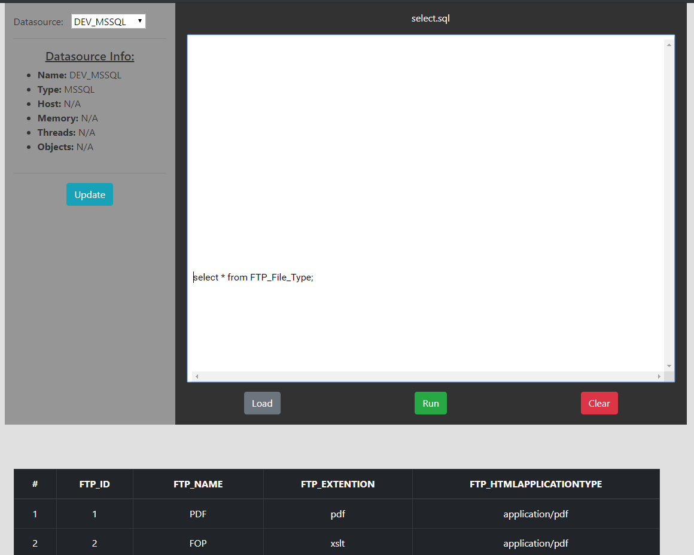
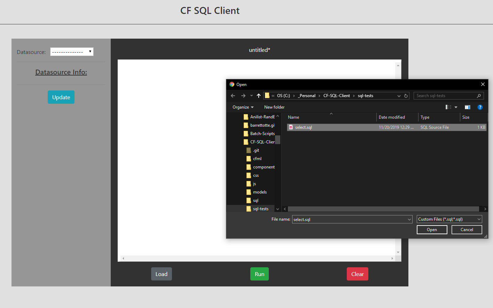

# CF-SQL-Client

An unfinished toy SQL client for MSSQL and IBMi DB2 written with Lucee, Bootstrap, and a bit of vanilla JS.

This was made to just screw around with Lucee, JS, and some SQL.
Its just a toy and by no means should be used seriously or at all.

<br>

[](screenshots/screenshot02.PNG)

<br>

## Features
* MSSQL support - I started IBMi DB2 but got bored of this project
* Execute multiple SQL statements
* File loading
* Resultset output with bootstrap
* Basic database information output

<br>

[](screenshots/screenshot01.PNG)


## Limitations / Issues
* I didn't feel like finishing it because ColdFusion makes me want to vomit.
* My encryption for credentials is just XOR encryption with a random number between 0 and 2048 lol...this is just a mess around project anyway.
* I wanted to use integrated security for MSSQL, but I ran into a bunch of issues. Its just easier to do user/password for setting up the datasource.
* SQL input can have multiple statements and are parsed using ';' as a delimiter.
* Comments aren't parsed right at all...I have no intention to fix it either.
* Each query is limited to 100 rows per statement execution.
* There's no guarantee that cloning and setting this up will even work. CommandBox sucks to setup, it doesn't work half the time.


## Setup
Enter datasources into **config.json**
```javascript
// config.json
{
  "datasources": [
    {
      "name":"MY_MSSQL",
      "type":"MSSQL",
      "class":"com.microsoft.jdbc.sqlserver.SQLServerDriver",
      "connectionString":"jdbc:sqlserver://someserver:1433;DATABASE_NAME",
      "username":"myuser",    // These will be encrypted
      "password":"mypassword" //   in the next step
    }
  ]
}
```

Start CommandBox in current directory with ```box.exe``` and run the encryption task with ```task run tasks/setup```.
This task will overwrite the configuration file with encrypted credentials.

Start the server with ```server start```


## Commands
* Start server ```CommandBox> server start cfengine=lucee```
* Restart current server ```CommandBox> restart```
* View log ```CommandBox> server log --follow```
* All in one ```CommandBox> restart && server log --follow```


## To Do
* Allow tab keypress in textarea (js)
* DB2 info
* Basic error handling


## Improvements
NOTE: These will never be done
* SQL Syntax highlighting
* Save textarea content to file
* Save resultset to JSON file
* Better error handling
* Better encryption, xor encryption is insanely weak
* Better statement parsing - comments
* Loading animation when loading file or executing query
* Database object browser - schemas, tables, columns


## References
* CF Admin - http://server:port/lucee/admin/web.cfm
* CommandBox - https://www.ortussolutions.com/products/commandbox
* **Learn Modern ColdFusion in 100 Minutes** - https://modern-cfml.ortusbooks.com/
* Lucee Docs - https://docs.lucee.org/index.html
* Lucce CommandBox - https://docs.lucee.org/guides/getting-started/commandbox.html
* Lucee Tutorials - https://lucee.org/learn/tutorials.html
* Server reloading examples - https://gist.github.com/nicklepedde/3277959
* Datasources in CF - https://coldfusion.adobe.com/2014/08/application-datasources-in-coldfusion/
* Generated favicon with https://favicon.io/
* SQL Server Operating System Docs - https://docs.microsoft.com/en-us/sql/relational-databases/system-dynamic-management-views/sql-server-operating-system-related-dynamic-management-views-transact-sql?view=sql-server-ver15
* Lucee 3rd party jars - https://docs.lucee.org/guides/working-with-source/3rd-party-libraries.html
